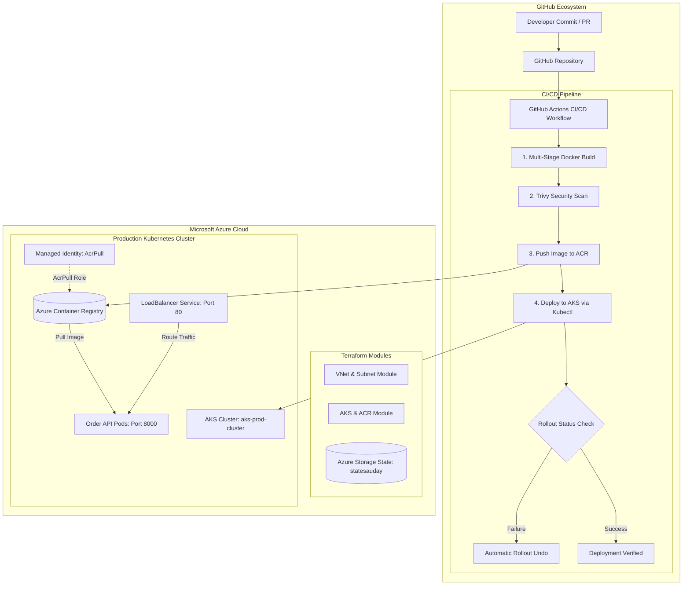

# Azure Modular AKS & GitOps CI/CD Platform

[](https://github.com/Udaytondwal1/azure-modular-aks-gitops/actions/workflows/pipeline.yaml)
[](https://www.terraform.io/)
[](https://azure.microsoft.com/en-us/products/kubernetes-service)
[](https://www.docker.com/)
[](https://github.com/aquasecurity/trivy)

An enterprise-ready, end-to-end cloud platform deploying a containerized microservice (`order-api`) to **Azure Kubernetes Service (AKS)** using **modular Terraform (IaC)**, **Azure Container Registry (ACR)**, and automated **GitHub Actions CI/CD** with Trivy vulnerability scanning and automated rollback capabilities.

---

## Architecture Overview



---

## Key Features

- **Modular Terraform Architecture**:
  - `modules/networking`: Provisions dedicated Azure Virtual Network (`10.0.0.0/16`) and AKS subnet (`10.0.1.0/24`).
  - `modules/aks_acr`: Provisions Azure Container Registry (`Standard` SKU) and AKS cluster with Azure CNI networking, Managed Identity, and automated `AcrPull` RBAC role assignment.
  - **Remote State Management**: Stores Terraform state in an Azure Blob Storage container with state locking.
- **Microservices Layer (`order-api`)**:
  - Lightweight REST service built on Node.js 22 & Express.
  - Endpoints:
    - `GET /health`: Health probe endpoint returning operational status and version.
    - `GET /`: Base endpoint serving production application status.
- **Production-Hardened Multi-Stage Dockerfile**:
  - Multi-stage build (`node:22-slim`) separating build dependencies from the runtime image.
  - Runs under the non-root `node` user for security best practices.
- **Kubernetes Resilience**:
  - `deployment.yaml`: Rolling update strategy (`maxSurge: 1`, `maxUnavailable: 0`), CPU/memory requests and limits, plus HTTP liveness and readiness probes.
  - `service.yaml`: Azure `LoadBalancer` service exposing public port `80` routed to container port `8000`.
- **Automated CI/CD with GitOps Rollback**:
  - Automated build and test on pushes and PRs.
  - Aqua Security Trivy container vulnerability scanner targeting `CRITICAL` and `HIGH` vulnerabilities.
  - Automatic deployment on `main` branch push.
  - Zero-downtime rollout with automated rollback (`kubectl rollout undo`) if health checks fail within 120 seconds.

---

## Repository Structure

```text
azure-modular-aks-gitops/
├── .github/
│   └── workflows/
│       └── pipeline.yaml          # GitHub Actions CI/CD with Trivy scan & auto-rollback
├── app/
│   ├── Dockerfile                 # Multi-stage hardened Node.js container
│   ├── package.json               # Node.js dependencies (Express 5)
│   ├── package-lock.json
│   ├── requirements.txt           # Python reference dependencies
│   └── server.js                  # Order API implementation (/ & /health)
├── k8s/
│   ├── deployment.yaml            # Kubernetes Deployment manifest with probes
│   └── service.yaml               # Kubernetes LoadBalancer Service manifest
├── terraform/
│   ├── backend.tf                 # Azure Blob remote state & azurerm provider config
│   ├── main.tf                    # Root orchestration module
│   ├── variables.tf               # Input variable declarations
│   ├── terraform.tfvars           # Environment configuration values
│   ├── output.tf                  # Cluster and ACR output references
│   └── modules/
│       ├── networking/            # VNet and Subnet module
│       │   ├── main.tf
│       │   ├── variables.tf
│       │   └── output.tf
│       └── aks_acr/               # AKS cluster, ACR, and RBAC module
│           ├── main.tf
│           ├── variables.tf
│           └── output.tf
├── .gitignore                     # Git ignore rules for Terraform & environments
└── README.md                      # Project documentation
```

---

## Infrastructure Specifications

| Component | Resource | Value / Configuration |
| :--- | :--- | :--- |
| **Cloud Provider** | Microsoft Azure | Region: `eastus` |
| **Resource Group** | `azurerm_resource_group` | `rg-aks-prod` |
| **Virtual Network** | `azurerm_virtual_network` | `vnet-aks-prod` (`10.0.0.0/16`) |
| **Subnet** | `azurerm_subnet` | `snet-aks-nodes` (`10.0.1.0/24`) |
| **Container Registry** | `azurerm_container_registry` | `acrprodaksdemo01` (`Standard` SKU) |
| **Kubernetes Cluster** | `azurerm_kubernetes_cluster` | `aks-prod-cluster` |
| **Node Pool** | System Pool | 2 nodes, `Standard_D2ads_v7`, 30 GB OS disk |
| **Network Plugin** | Azure CNI (`azure`) | Service CIDR: `10.1.0.0/16`, DNS: `10.1.0.10` |
| **Authentication** | Managed Identity | System-Assigned (`AcrPull` on ACR) |
| **Remote Backend** | Azure Blob Storage | RG: `Uday-rg`, Account: `statesauday`, Container: `state-container` |

---

## Getting Started

### 1. Prerequisites

- [Azure CLI](https://learn.microsoft.com/en-us/cli/azure/install-azure-cli) (`az`)
- [Terraform CLI](https://developer.hashicorp.com/terraform/downloads) (>= 1.5.0)
- [Docker](https://docs.docker.com/get-docker/)
- [kubectl](https://kubernetes.io/docs/tasks/tools/)

### 2. Azure Remote State Setup

Ensure the storage account and container exist prior to initializing Terraform:

```bash
# Log in to Azure
az login

# Create resource group and storage account for Terraform backend
az group create --name Uday-rg --location eastus
az storage account create --name statesauday --resource-group Uday-rg --location eastus --sku Standard_LRS
az storage container create --name state-container --account-name statesauday
```

### 3. Provision Infrastructure with Terraform

```bash
cd terraform

# Initialize providers and remote backend
terraform init

# Validate configuration
terraform validate

# Review execution plan
terraform plan

# Apply infrastructure deployment
terraform apply -auto-approve
```

Retrieve AKS cluster credentials once applied:

```bash
az aks get-credentials --resource-group rg-aks-prod --name aks-prod-cluster
```

---

## Application Development & Local Testing

### Run Locally with Node.js

```bash
cd app
npm install
npm start
```
The API will be available at `http://localhost:8000` (`/` and `/health`).

### Build & Run with Docker

```bash
# Build image
docker build -t order-api:local ./app

# Run container
docker run -d -p 8000:8000 --name order-api order-api:local

# Test health check
curl http://localhost:8000/health
```

---

## CI/CD Pipeline & GitHub Secrets

The GitHub Actions workflow (`.github/workflows/pipeline.yaml`) automatically builds, scans, pushes, and deploys the application.

### Required GitHub Secrets

Configure the following secrets in your GitHub repository (**Settings > Secrets and variables > Actions**):

| Secret Name | Description |
| :--- | :--- |
| `AZURE_CLIENT_ID` | Service Principal App ID |
| `AZURE_CLIENT_SECRET` | Service Principal Client Secret |
| `AZURE_TENANT_ID` | Azure Tenant / Directory ID |
| `AZURE_SUBSCRIPTION_ID` | Azure Subscription ID |
| `ACR_NAME` | Azure Container Registry name (e.g. `acrprodaksdemo01`) |
| `AKS_NAME` | AKS cluster name (e.g. `aks-prod-cluster`) |
| `RESOURCE_GROUP` | Azure Resource Group name (e.g. `rg-aks-prod`) |

### Automated Rollback Strategy

During deployment, the pipeline validates pod readiness:
```bash
if kubectl rollout status deployment/order-api --timeout=120s; then
  echo "Deployment successful!"
else
  echo "Deployment failed! Rolling back..."
  kubectl rollout undo deployment/order-api
  exit 1
fi
```
If pods fail health checks or enter `CrashLoopBackOff`, the release is automatically reverted to the last known good revision, preventing downtime.

---

## Verification & Monitoring

Check the status of running resources inside the AKS cluster:

```bash
# Check Pod status
kubectl get pods -l app=order-api

# Check Service & External IP
kubectl get svc order-api-service

# Check Deployment rollout history
kubectl rollout history deployment/order-api

# View application logs
kubectl logs -l app=order-api -f
```

Hit the public IP assigned by Azure LoadBalancer:
```bash
curl http://<EXTERNAL-IP>/health
```

---

## Author & Maintainer

- **GitHub**: [@Udaytondwal1](https://github.com/Udaytondwal1)
